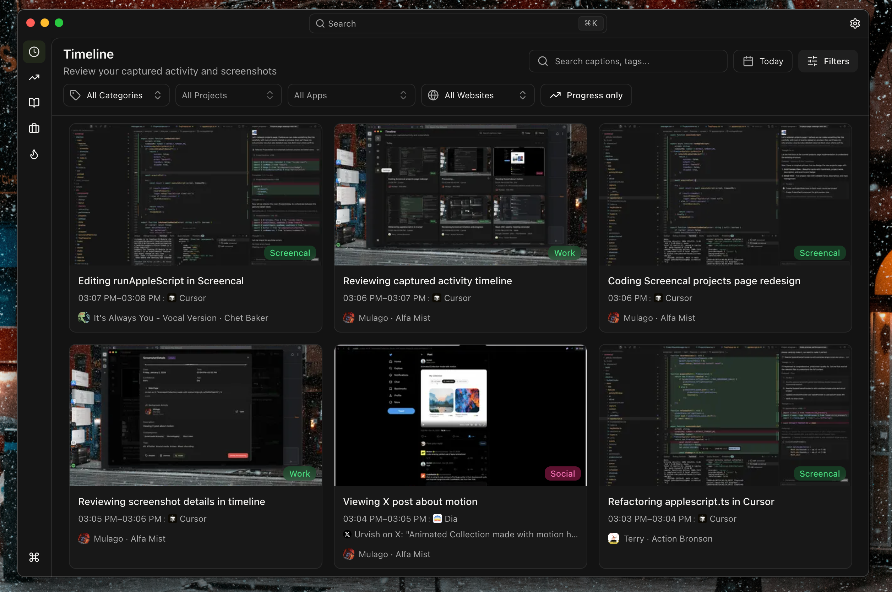
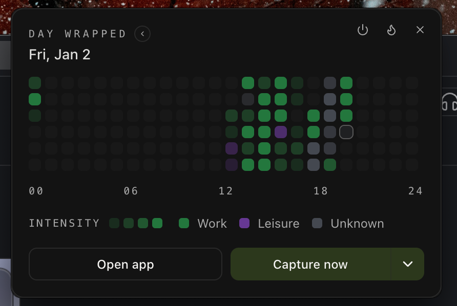
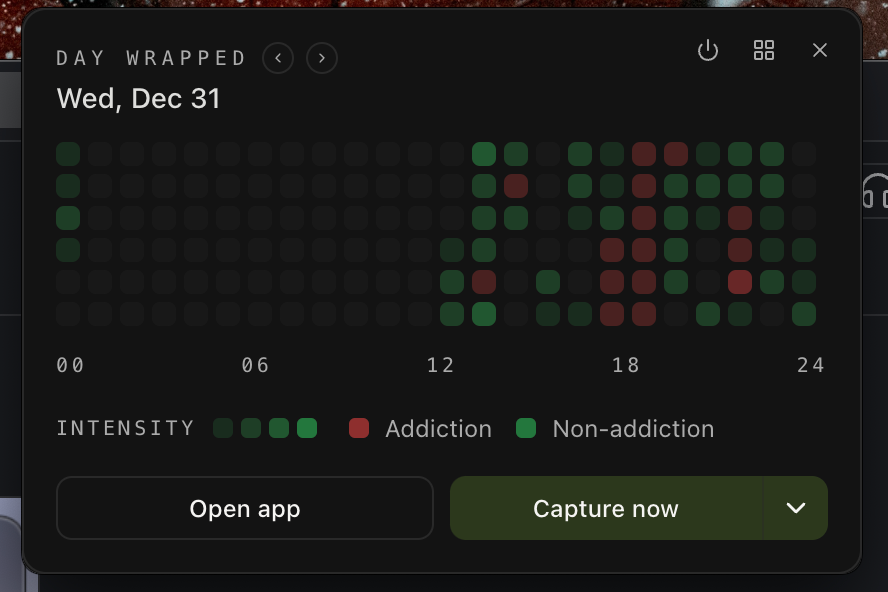
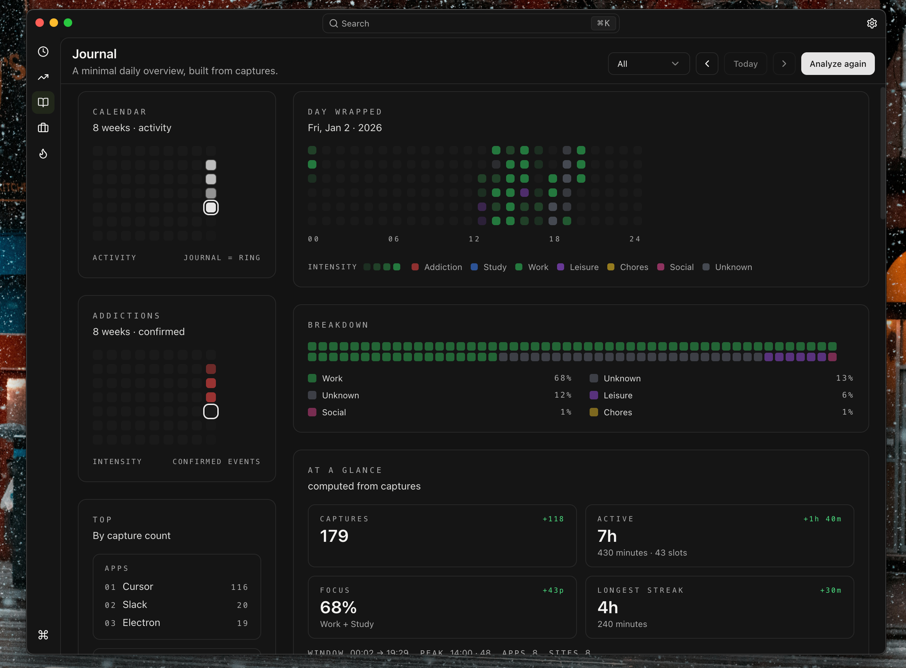
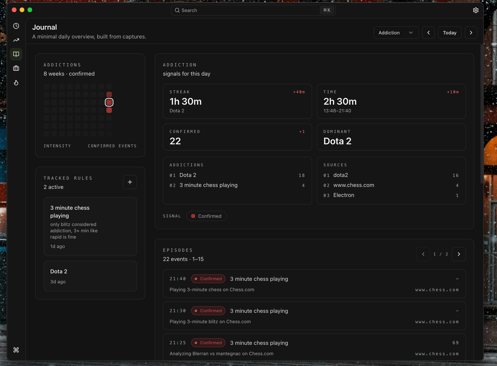
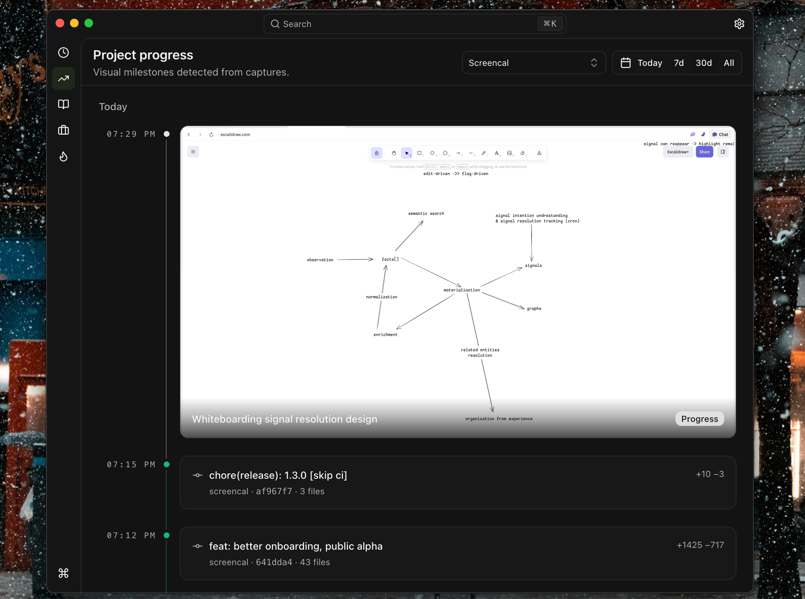

# Screencap

Understand where your day went

Screencap is a macOS desktop app that captures screenshots on a schedule and turns them into a timeline, a daily “Day Wrapped”, and a journal you can use to better undrestand your time

Inside:

- Timeline of events with context (app, window title, browser host, media, IDE workspace)
- Day Wrapped tray popup + daily journal
- Project progress (automatic + manual “capture milestone”)
- Projects + Git (link repos to see commits + work sessions)
- Addictions (track, review, confirm/reject)

LLM classification is optional and can run locally or via a cloud provider

[Download](https://github.com/yahorbarkouski/screencap/releases) · [Changelog](CHANGELOG.md) · [Security](docs/security.md) · [Sharing & E2EE](docs/security-sharing.md) · [Local LLM](docs/local-llm.md) · [Context providers](docs/adding-context-providers.md)

## Tour

### Timeline



This is where everything lands.

- **Each card is an event**: multiple captures can be merged into one time window when the context stays the same and the pixels are similar.
- **Context is the point**: app name, window title, browser host, media title, and IDE workspace are captured (when permissions allow).
- **It’s editable**: open a card to relabel, dismiss/delete, copy the image, and create per-app/per-website rules.

### Day Wrapped (tray popup)

The tray widget is the “what happened today?” view + quick actions.



- Colors map to categories (Work/Study/Leisure/…); intensity reflects how many captures fell into each time slot.
- Use this when you want the simplest “heatmap” view of your day.



- Switches the same timeline into an addiction-focused overlay (confirmed signals stand out immediately).
- Includes actions like **Capture now** and **Capture project progress**.

### Journal



The journal view turns captures into a daily summary:

- Dayline + breakdown + “at a glance” metrics (active time, focus, streaks, top apps/sites/projects).
- A journal entry you can write manually, or generate via an LLM (if you configure one).

### Addictions



Addictions are rules you define and then track over time:

- The app can surface **candidates**, but you can **confirm** or **reject** them per-event.
- You get calendar + episodes + streak/time metrics so it’s measurable, not vibes.

### Project progress



Progress is a dedicated timeline for “things that moved”:

- Shows progress screenshots (automatic or manual “capture milestone”).
- Can also show Git commits and work sessions if you link local repos in **Projects**.

## Install (macOS)

1. Download the latest DMG from [Releases](https://github.com/yahorbarkouski/screencap/releases).
2. Open the DMG and run `install.command` (recommended) or drag `Screencap.app` to Applications.
2. Open the app (it has a main window and a tray icon; closing the window keeps it running in the background).
3. Grant Screen Recording permission when prompted.

**Note**: If macOS shows "Screencap is damaged and can't be opened", it's quarantine. `install.command` removes it for you. If you drag manually, you can remove it with:

```bash
xattr -dr com.apple.quarantine /Applications/Screencap.app
```

If the app is already in `/Applications`, this may require admin rights on some machines.

Recommended for better context:

- Accessibility (window titles)
- Automation (System Events + browsers + apps like Spotify)

In development builds, macOS may show the app as **Electron** in permission dialogs.

## First run

- Open **Settings → Capture** and choose a capture interval.
- Open **Settings → Data** and set retention.
- Optional AI:
  - **Settings → AI** → add an OpenRouter key (cloud) or enable a Local LLM.
  - **Allow vision uploads** is ON by default. Turn it OFF if you don’t want screenshots uploaded.

## Shortcuts

- Command palette: **⌘K**
- Global hotkeys (customizable in Settings → Capture):
  - Capture now: **⌘⇧O**
  - Capture project progress: **⌘⇧P** (opens the caption popup)

## How capture works

Scheduled capture is “dominant activity”:

- Foreground context is sampled every second.
- Once a context stays stable for ~10s, Screencap takes one candidate multi-display capture.
- At the end of the interval it keeps the dominant candidate and discards the rest.
- Captures close in time + same context + similar pixels are merged into one event.

## AI pipeline

When classification is enabled, events go through:

1. Local reuse cache (fingerprint + context key)
2. Local retrieval from your history
3. Local LLM (optional, OpenAI-compatible HTTP)
4. Cloud text (optional, OpenRouter)
5. Cloud vision (optional, can be disabled via “Allow vision uploads”)
6. Local baseline fallback

OCR runs locally (macOS Vision). High-res PNG is only kept for progress events (storage minimization).

## Data & networking

Screencap stores captures locally, but it can make network requests (favicons, updates, cloud AI). If you need strict privacy, treat this like any other screen recording tool and lock it down accordingly.

Local:

- SQLite database + screenshot files under `app.getPath("userData")` (typically `~/Library/Application Support/Screencap/`).

Network:

- OpenRouter (only if configured). Default is **text-first** (context + OCR) with **vision fallback**. Screenshot uploads can be disabled via **Allow vision uploads**.
- Favicons (bounded + blocks localhost/private ranges).
- Auto-updates (packaged builds only; uses GitHub releases).

## Development

Requirements:

- macOS
- Node.js + npm

Run:

```bash
npm install
npm run dev
```

Tests:

```bash
npm test
```

Build:

```bash
npm run build
npm run preview
```

Packaging:

```bash
npx electron-builder --config electron-builder.yml
```

OCR in dev:

- Ensure `build/ocr/screencap-ocr` exists (packaged builds bundle it automatically).

Evaluation harness:

```bash
npm run eval:classification -- --limit=25 --strategies=vision,text,local
```

## Repo layout

- `electron/main`: capture, scheduler, db, queue, context, tray/popup, updates, hardening
- `electron/preload`: `window.api` bridge
- `electron/shared`: IPC channel names + shared types
- `src`: React UI

## Contributing

Read `docs/security.md` before adding new IPC or file access surfaces.

## License

MIT (see `LICENSE`).
