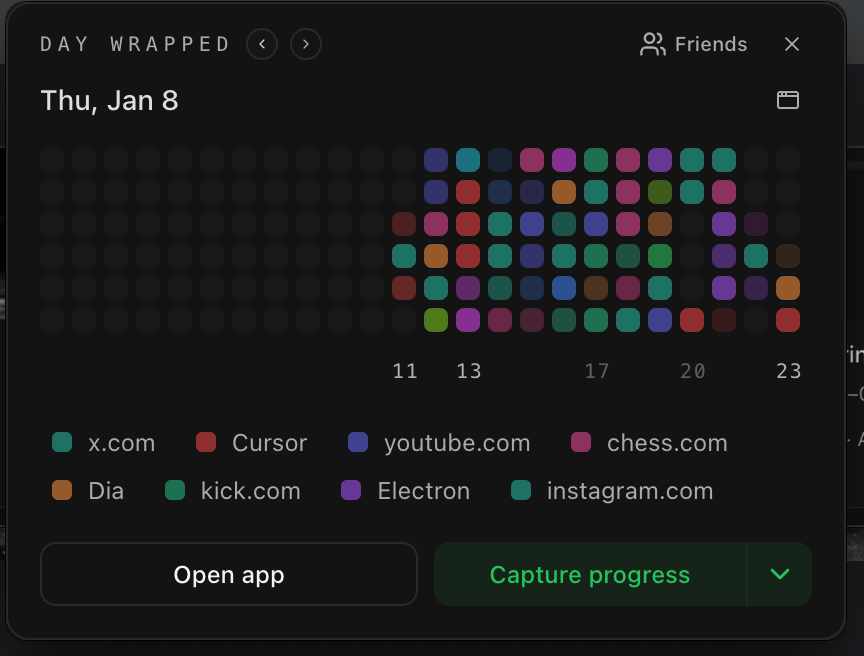
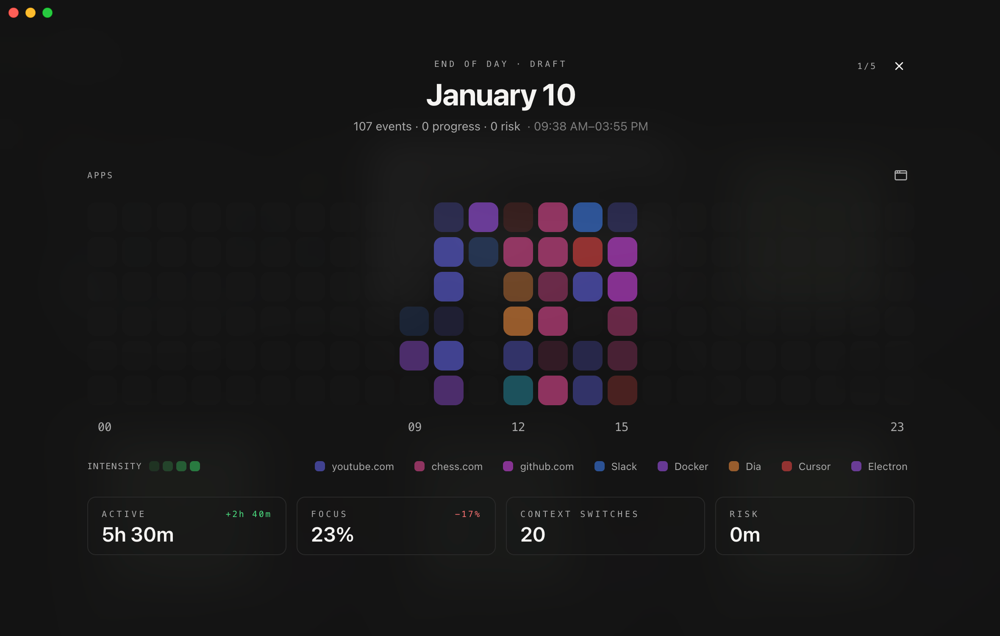
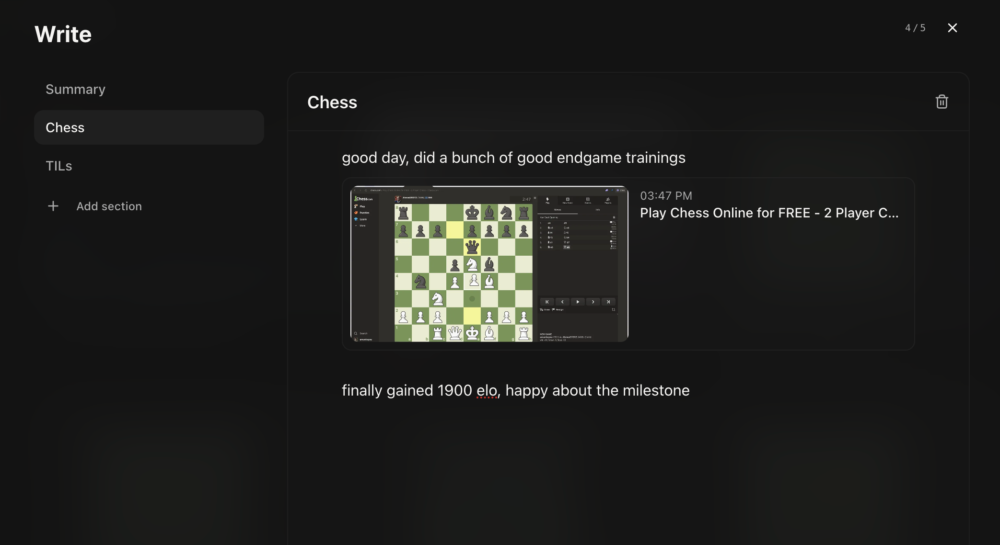
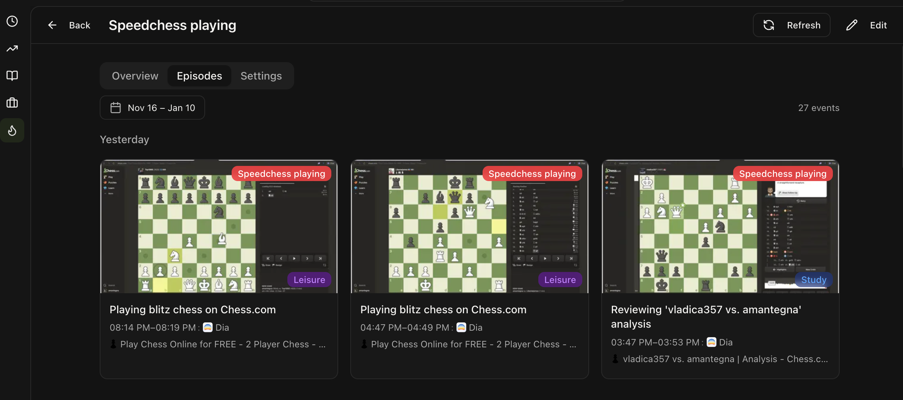
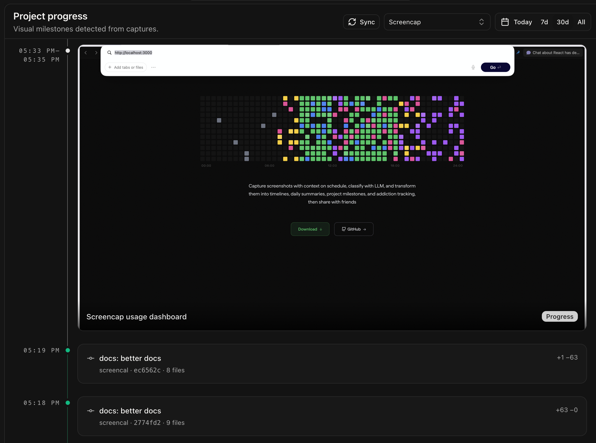
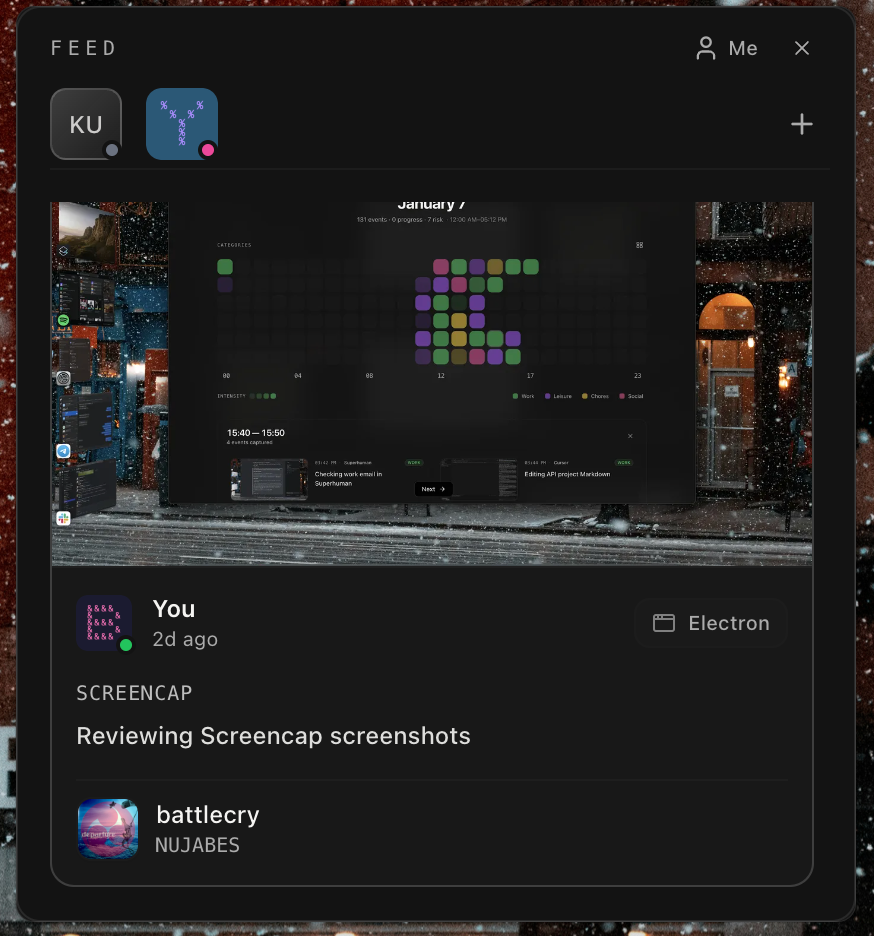
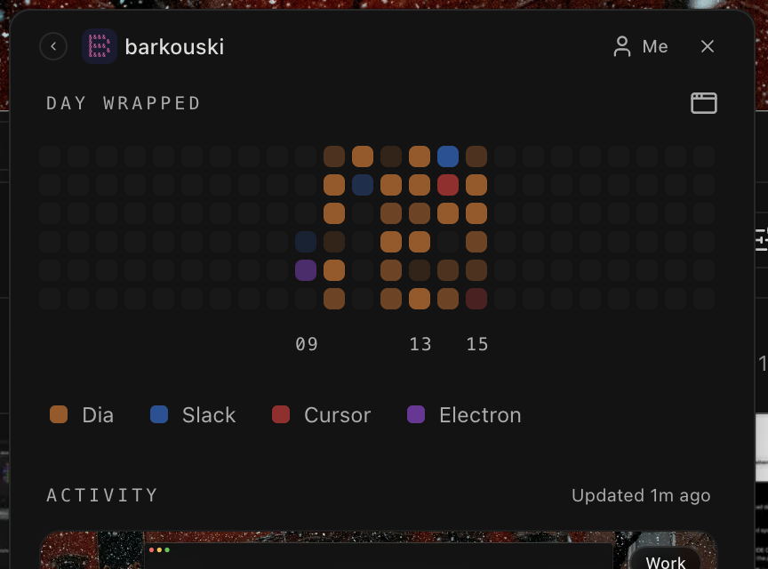

# Screencap

To understand where your day went

A macOS desktop app that captures screenshots, windows and apps (both background and foreground) on a schedule and transforms them into a timeline, daily summaries, project milestones, addiction tracking, with optional E2E-encrypted social feed.
Screencap answers the questions like:

- *What did I actually do today?*
- *How long did I really work?*
- *Am I spending too much time on Chess?*
- *What progress did I make on my project?*
- *What my colleagues are doing?*
- *What actual progress on project X has been made since September?*

The idea behind this opensource is to inspire as many forks as possible. The project (both app and [social backend](https://github.com/yahorbarkouski/screencap-website)) are fully free to use, enrouranging everyone to customise and build their own Screencaps.
Project started as a background project tracker, as we all tend to have zero-to-little screenshots from projects we worked on for months. Then addiction tracker came it, the Spotify background played, End Of Day flow, activity popup, and social E2E network in tray (I couldn't help myself)

[Download](https://github.com/yahorbarkouski/screencap/releases) · [Changelog](CHANGELOG.md) · [Security](docs/security.md) · [E2EE & Sharing](docs/security-sharing.md) · [Local LLM](docs/local-llm.md)

---

## Features Summary

### Timeline


Time period (day), visualized as a stream of events

- **Each card is an event** — multiple captures with the same context and similar pixels merge into one time window
- **Rich context extraction** — app name, window title, browser URL, media playing, and per-app lower contexts like VS Code workspace
- **Fully editable** — relabel events, dismiss captures, copy screenshots, create per-app or per-website automation rules, mark as progress or addiction (by default done automatically via llms)

### Day Wrapped

The tray widget "what happened today?" with quick actions and different views available.


<table>
<tr>
<td colspan="2" align="center">



**Apps View** - see which apps and websites dominated each time slot

</td>
</tr>
<tr>
<td width="50%" align="center">


**Categories** - what categories dominated

</td>
<td width="50%" align="center">


**Addictions** - confirmed signals highlighted

</td>
</tr>
</table>

Quick actions:

- **Capture now** — trigger an immediate capture
- **Capture project progress** — save a milestone with a caption (screenshots active window and waits for a comment. would want to double-down and add loom-like view support one day)

### Journal


To turn your day into a narrative

- **Dayline visualization** — see your entire day at a glance with category colors
- **Breakdown metrics** — active time, focus percentage, longest streak, top apps/sites/projects
- **End of Day** — optional LLM-powered daily recap (or the one from End of Day flow below)
- **Manual journaling** — write reflections, embed event screenshots, create custom sections

### End of Day Flow

A guided ritual to close your day intentionally, guides you through:

1. **Summary** — metrics and dayline visualization
2. **Progress Review** — confirm or promote potential milestones
3. **Addictions Review** — acknowledge or dismiss flagged events
4. **Write** — compose custom sections with embedded event screenshots


|                                          Summary                                          |
|:-----------------------------------------------------------------------------------------:|
|                             |
|               active time, focus, progress milestones, addiction episodes.                |


|                           Write                            |
|:----------------------------------------------------------:|
|  |
| to  compose with embedded screenshots and custom sections. | 


### Addictions

Define behaviors you want to track, then measure. Bullet chess in my case:) But is thought for games and porn too, so tricky events are well-covered.


| Overview | Example: Speed Chess |
|:---:|:---:|
|  |  |
| Calendar heatmap, streak counter, and episode timeline. See patterns across weeks. | Track specific behaviors like bullet chess. The AI detects candidates, you confirm episodes. |


- **Create rules** — define what counts as an addiction
- **AI detection** — the LLM surfaces candidates based on content (either image OCR or image itself + Accessibility context)
- **Calendar view** — see patterns across weeks
- **Streak tracking** — visualize consecutive clean days
- **Episode timeline** — drill into specific incidents with screenshots

### Project Progress



A dedicated timeline for milestones and momentum, the foundation for multiplayer collaboration

- **Automatic detection** — AI identifies progress-worthy captures
- **Manual milestones** — `⌘⇧P` to capture and caption a moment
- **Git integration** — link local repositories to see commits alongside work sessions
- **Multi-project filtering** — track progress across all projects or focus on one

**Sharing:** Projects can be shared with friends via encrypted rooms. Invite collaborators by username, and everyone sees each other's milestones in a unified timeline. All shared content is end-to-end encrypted; the server never sees your screenshots or captions, but just in case you can selfhost and set your own backend, for a better guide see screencap-website project

### Social & Friends

So you can feel-not-ask each other:)

|                            Activity Feed                            | Friend's Day |
|:-------------------------------------------------------------------:|:---:|
|             |  |
| See what friends are working on. Screenshots, captions, and context | View a friend's dayline, categories, and recent activity in real-time. |

The flow is simple:

- **Choose a username**
- **Add friends**
- **Share Day Wrapped** — let friends see your dayline in real-time
- **Shared projects** — invite friends to project rooms, see their milestones
- **Comments** — react to shared events with threaded messages
- **Activity feed** — see what friends are working on

### Context Providers

Screencap extracts rich context from your active window:


| Provider          | What it captures                                         |
| ----------------- | -------------------------------------------------------- |
| System Events     | Frontmost app, window title, fullscreen state            |
| Safari            | Current URL, page title                                  |
| Chromium browsers | Current URL, page title (Chrome, Arc, Brave, Edge, etc.) |
| Spotify           | Track name, artist, album art                            |
| Cursor/VS Code    | Workspace path, project name                             |


With accessibility + automation permissions, we can get pretty much precise context

### LLM Classification

When enabled, events go through a multi-step classification pipeline:

1. **Cache reuse** — instant match by fingerprint + context
2. **Local retrieval** — match against your own history
3. **Local LLM** — Ollama, LM Studio, or any OpenAI-compatible server
4. **Cloud text** — OpenRouter with context + OCR (no images)
5. **Cloud vision** — OpenRouter with screenshots (if enabled)
6. **Fallback** — baseline classification from context alone

Classification output:

- **Category** — Work, Study, Leisure, Social, Chores, Unknown
- **Project** — detected project name
- **Caption** — human-readable description
- **Addiction candidate** — potential matches against your rules
- **Progress detection** — milestone-worthy content


### Automation Rules

Fine-grained control over capture and classification:


| Rule               | Effect                                   |
| ------------------ | ---------------------------------------- |
| **Skip capture**   | Don't screenshot this app/website at all |
| **Skip AI**        | Capture locally but never send to LLM    |
| **Force category** | Always assign Work/Study/etc.            |
| **Force project**  | Always tag captures with a project       |


Create rules from any event card or in Settings->Automation.

---

## Privacy & Security

Local-first overall, but for LLM classification both local and remote (openrouter/openai) options are available.


### What stays local

- SQLite database under `~/Library/Application Support/Screencap/`
- All screenshots (thumbnails + originals)
- Settings and encryption keys (Keychain-encrypted)

### What can go to the network (opt-in)


| Feature         | Data sent          | Where                                                   |
| --------------- | ------------------ |---------------------------------------------------------|
| Cloud AI        | Context + OCR text | OpenRouter/OpenAI                                       |
| Cloud Vision    | Screenshot images  | OpenRouter/OpenAI (if enabled)                          |
| Friends/Sharing | Encrypted events   | Backend (default: screencaping.com; can be self-hosted) |
| Auto-updates    | Version check      | GitHub Releases                                         |


### End-to-End Encryption

All shared content (screenshots, captions, chat) is encrypted on your device before upload.

- **Device identity** — Ed25519 signing key + X25519 key agreement key
- **Room keys** — 32-byte secrets, per-recipient-device encrypted envelopes
- **Event encryption** — AES-256-GCM with keys derived via HKDF
- **Chat encryption** — DMs use X25519 shared secret; rooms use room key

The server sees ciphertext, metadata (timestamps, usernames, project names), and encrypted blobs. It cannot read content.

See [Security & Privacy: Sharing](docs/security-sharing.md) and [E2EE Crypto Spec](docs/friends-rooms-e2ee.md).

---

## Install

### Requirements

- macOS 13+ (Ventura or later)
- Screen Recording permission (required)
- Accessibility permission (recommended)
- Automation permissions (recommended)

### Download

1. Grab the latest DMG from [Releases](https://github.com/yahorbarkouski/screencap/releases)
2. Open the DMG and drag `Screencap.app` to Applications
3. Launch — the onboarding wizard guides you through permissions and setup

### Permissions


| Permission                 | Purpose                           | Required?   |
| -------------------------- | --------------------------------- | ----------- |
| Screen Recording           | Capture screenshots               | Yes         |
| Accessibility              | Read window titles                | Recommended |
| Automation -> System Events | Identify focused window           | Recommended |
| Automation -> Browsers      | Read URLs from Safari/Chrome/etc. | Recommended |
| Automation -> Media apps    | Capture Spotify track info        | Optional    |


---

## First Run

The onboarding wizard walks you through:

1. **Screen Recording** — grant the core permission
2. **Accessibility** — enable rich window context
3. **Automation** — allow per-app context extraction
4. **AI Setup** — choose Cloud, Local, or Disabled
5. **First Capture** — see what Screencap captures

After onboarding:

- Capture interval is set in **Settings -> Capture**
- Retention period is set in **Settings -> Data**
- Global shortcuts are customizable in **Settings -> Capture -> Shortcuts**

---

## Shortcuts


| Action                   | Default | Notes                              |
| ------------------------ | ------- | ---------------------------------- |
| Command palette          | `⌘K`    | Quick access to any view or action |
| Capture now              | `⌘⇧O`   | Immediate screenshot               |
| Capture project progress | `⌘⇧P`   | Opens caption popup for milestone  |
| End of Day               | `⌘⇧E`   | Open the journal flow              |


All shortcuts are configurable in **Settings -> Capture -> Shortcuts**.

---

## How Capture Works

Screencap uses dominant activity scheduling:

1. **Sample context every second** — which app, window, URL is in focus
2. **Wait for stability** — context must be stable for ~10 seconds
3. **Capture candidate** — take a multi-display screenshot
4. **Keep the dominant** — at the end of the interval, save the most representative capture
5. **Merge similar events** — captures with same context + similar pixels become one event

This means:

- Quick app switches don't produce captures
- You get one clean event per sustained activity
- Storage usage stays reasonable

The overall capturing algo is still in very rough and can be very much improved

---

## LLM Configuration

### Cloud LLM (OpenRouter / OpenAI)

Screencap uses OpenRouter by default, but any OpenAI-compatible API works

1. Get an API key from [openrouter.ai/keys](https://openrouter.ai/keys) or [platform.openai.com](https://platform.openai.com/api-keys)
2. **Settings -> AI -> Cloud LLM** -> paste your key
3. Choose a model (default: `openai/gpt-5-mini`)
4. Toggle **Allow vision uploads** if you want image-based classification

OpenRouter gives you access to many models (Claude, GPT-5, Gemini, open-source) through one API key, so very much recommended

### Local LLM (Ollama / LM Studio)

1. Run a local OpenAI-compatible server
2. **Settings -> AI -> Local LLM** -> enable and configure:
- Base URL: `http://localhost:11434/v1` (Ollama) or `http://localhost:1234/v1` (LM Studio)
- Model: the model name from `/v1/models`
3. Click **Test** to verify

See [Local LLM Guide](docs/local-llm.md) for detailed setup.

### Disable AI

**Settings -> AI -> Classification -> Off**

Captures still happen, but no LLM calls. Events get basic category from context only.

---

## Social Setup

### Create Your Identity

1. Open the **tray popup** -> Social tab
2. Choose a username (alphanumeric, unique)
3. Your device generates E2EE keys automatically

### Add Friends

1. Click **+** in the Social tab
2. Enter their username
3. They accept your request

### Share Day Wrapped

**Settings -> Social -> Day Wrapped Sharing -> Enable**

Friends see your dayline in their feed. You control what's shared:

- Categories (always)
- App names (optional)
- Addiction flags (optional)

### Share Projects

1. Open **Projects** -> select a project -> **Share**
2. Invite friends by username
3. They accept the room invite and see your milestones

---

## Self-Hosting

Screencap's backend is open source. Run your own:

1. **Settings -> System -> Custom Backend -> Enable**
2. Enter your backend URL
3. See [Self-Hosted Backend Guide](docs/self-hosted-backend.md)

Your data, your server, full control.

---

## Development

### Requirements

- macOS
- Node.js 20+
- npm

### Setup

```bash
git clone https://github.com/yahorbarkouski/screencap.git
cd screencap
npm install
```

### Run

```bash
npm run dev
```

### Test

```bash
npm test
```

### Build

```bash
npm run build
npm run preview
```

### Package

```bash
npx electron-builder --config electron-builder.yml
```

---

## Architecture

```
screencap/
├── electron/
│   ├── main/           # Main process
│   │   ├── app/        # Window, tray, popup, lifecycle
│   │   ├── features/   # Capture, AI, context, social, sync
│   │   ├── infra/      # Settings, logging, storage
│   │   └── ipc/        # Secure IPC handlers
│   ├── preload/        # Context bridge (window.api)
│   └── shared/         # IPC channels, shared types
├── src/                # React renderer
│   ├── components/     # UI components
│   ├── hooks/          # React hooks
│   ├── lib/            # Utilities
│   └── stores/         # Zustand stores
└── docs/               # Documentation
```

### Key Services


| Service                 | Purpose                            |
| ----------------------- | ---------------------------------- |
| `CaptureService`        | Screenshot capture, fingerprinting |
| `ContextService`        | App/window/URL/media extraction    |
| `ClassificationService` | AI pipeline orchestration          |
| `EventService`          | Event creation, merging, storage   |
| `IdentityService`       | E2EE key management                |
| `RoomsService`          | Shared project rooms               |
| `SocialFeedService`     | Friend activity publishing         |


---

## MCP Integration (Claude Desktop / Cursor)

Screencap includes a built-in MCP server that exposes your activity data to Claude Desktop, Cursor, and other MCP-compatible tools. The MCP server is bundled with the app and does not require a separate build step.

### Configure Claude Desktop

Add to `~/Library/Application Support/Claude/claude_desktop_config.json`:

```json
{
  "mcpServers": {
    "screencap": {
      "command": "/usr/bin/env",
      "args": [
        "-u",
        "ELECTRON_RUN_AS_NODE",
        "/Applications/Screencap.app/Contents/MacOS/Screencap",
        "--mcp"
      ]
    }
  }
}
```

For detailed documentation, see [MCP Server Guide](docs/mcp-server.md).


### Available Tools

| Tool | Description |
|------|-------------|
| `query_events` | Query events with filters (date, category, project, app) |
| `search_events` | Full-text search across captions and window titles |
| `get_recent_activity` | Quick access to recent events |
| `get_time_summary` | Category/project time breakdown |
| `get_app_usage` | App usage statistics |
| `get_website_usage` | Website usage statistics |
| `compare_periods` | Compare productivity across two periods |
| `get_project_progress` | Progress events for a project |
| `list_projects` | All projects with stats |
| `get_addiction_stats` | Addiction tracking data |
| `get_focus_score` | Focus/distraction score for a day |
| `get_event_image` | Get thumbnail for a specific event |

### Available Resources

| Resource | Description |
|----------|-------------|
| `screencap://activity/today` | Today's activity events |
| `screencap://activity/recent` | Recent 2 hours of activity |
| `screencap://stats/today` | Today's category breakdown |
| `screencap://stats/week` | This week's statistics |
| `screencap://projects` | All projects with stats |
| `screencap://stories/latest` | Recent daily/weekly stories |
| `screencap://memories` | User-defined memories |
| `screencap://eod/today` | Today's end-of-day entry |

### Available Prompts

| Prompt | Description |
|--------|-------------|
| `daily_summary` | Summarize activity for a day |
| `project_status` | Get status of a specific project |
| `focus_analysis` | Analyze focus and distraction patterns |

### Example Usage

In Claude Desktop or Cursor, you can now ask:

- "What was I working on today?"
- "How did I spend my time this week?"
- "Show me progress on the Screencap project"
- "Am I spending too much time on YouTube?"
- "Compare my productivity this week vs last week"

The LLM will use the appropriate tools to query your Screencap data and provide insights.

---

## Contributing

Read [Security Practices](docs/security.md) before adding new IPC handlers or file access surfaces.

Key principles:

- Treat IPC as a security boundary
- Validate all renderer inputs with Zod
- Use the `secureHandle` wrapper for new handlers
- Prefer allowlists over blocklists

---

## Known Limitations and Pitfalls

>  **This project is in beta.** Expect rough edges, breaking changes, and behaviors that may surprise you.

### AI Usage Can Spike Unexpectedly

The classification pipeline can make **up to 2 LLM calls per screenshot** (one for general classification, another for addiction verification). There's no rate limiting or cost tracking - if you capture frequently, your API bill can grow fast. Small models work best tho, but be thoughtful about this for a while

**What's needed:** smarter classification logic, caching improvements, and optional cost caps.

### Event Trimming is Time-Based Only

Retention cleanup deletes old data based on time thresholds, not activity relevance. Important events get purged alongside noise if they're past the retention window.

**What's needed:** activity-aware or user-marked retention. Really curious one.

### Hardcoded Thresholds

Many parameters are fixed /theoretically/:

- Fingerprint similarity thresholds
- Capture stability window (10s)
- Merge gap for events (~2× capture interval)
- HQ image retention (12 hours)

These may not fit all workflows and require some good practice to make sense / become dynamic

### macOS Only

The entire context system uses AppleScript, macOS Vision, and Apple-specific APIs

If any of these bother you, PRs are very welcome

---

## License

MIT