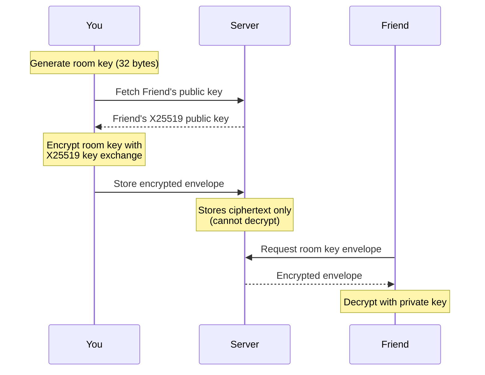
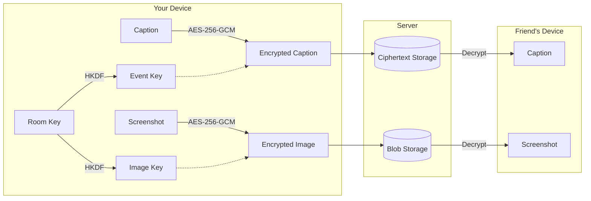

# Security & Privacy: Sharing, Rooms, and Friends

This document explains how Screencap protects your data when you share projects with friends. We designed sharing with a simple principle: **your screenshots and captions stay yours**. The server facilitates connections but never sees your content.

## The short version

- All shared content (screenshots, captions, chat messages) is **end-to-end encrypted**
- Encryption keys are generated on your device and **never leave it** in plaintext
- The server stores only ciphertext it cannot decrypt
- Your local data remains on your device; sharing creates encrypted copies

## What gets encrypted

| Data | Encryption | Server sees |
|------|-----------|-------------|
| Progress screenshots | AES-256-GCM | Encrypted blob |
| Event captions | AES-256-GCM | Ciphertext |
| Chat messages (DMs) | AES-256-GCM | Ciphertext |
| Chat messages (project) | AES-256-GCM | Ciphertext |
| Room keys | X25519 + AES-256-GCM envelopes | Encrypted envelopes (per-device) |

## What the server knows

The server needs some metadata to route data:

- **Username** (you choose it; no email or real name required)
- **Device public keys** (for key exchange and request signing)
- **Room names** (project names are visible to the server)
- **Membership** (who is in which room)
- **Timestamps** (when events were created)

The server **cannot** read:

- Screenshot images
- Event captions or descriptions
- Chat message content
- Room encryption keys

## How encryption works

### Device identity

When you sign up, your device generates two keypairs:

1. **Signing keypair** (Ed25519) — authenticates your API requests
2. **Key agreement keypair** (X25519) — enables secure key exchange

Private keys are stored locally, encrypted with your Mac's Keychain (via Electron `safeStorage`). They never leave your device.

### Room keys

Each shared project has a **room key** — 32 random bytes generated on your device when you first share the project.

When you invite someone:

1. Your device fetches their public key from the server
2. It encrypts the room key specifically for their device using X25519 key exchange
3. The encrypted envelope is stored on the server
4. They can decrypt it only with their private key

This means:

- Each recipient gets a unique encrypted envelope
- The server cannot decrypt any envelope (no private keys)
- If someone is removed, they keep past keys but won't receive new ones



### Event encryption

When you share a progress event:

1. Event payload (caption, image reference) is encrypted with a key derived from the room key
2. Screenshot is encrypted separately with another derived key
3. Both are uploaded as ciphertext/encrypted blobs
4. Recipients decrypt using their copy of the room key

Key derivation uses HKDF-SHA256 with distinct info strings, so compromising one key type doesn't compromise others.



### Chat encryption

**Direct messages** use a shared secret derived from both parties' X25519 keys. Only you and your friend can derive this key.

**Project chat** uses a key derived from the room key. All room members can read messages; non-members cannot.

## Request authentication

Every API request is signed:

```
signature = Ed25519-Sign(method + path + timestamp + bodyHash)
```

The server verifies:

1. Signature matches the registered public key
2. Timestamp is within 5 minutes (prevents replay attacks)
3. User has permission for the requested action

## What about the server operator?

Honest answer: the server operator (us, if you're using the default backend) can see metadata. We can see that user A shared a project with user B. We can see when events were uploaded. We **cannot** see what's in those events.

If you're concerned about metadata, you can:

1. Self-host the backend (it's open source)
2. Use generic usernames
3. Use the app without the social features (local-only mode)

## Keys at rest

| Secret | Storage |
|--------|---------|
| Device private keys | Keychain-encrypted JSON file |
| Room keys | SQLite, encrypted with Keychain |
| API key (OpenRouter) | Settings store, encrypted with Keychain |

On Macs without Keychain access, secrets fall back to plaintext storage. The app warns you about this during setup.

## Public links

Public links embed the room key in the URL fragment:

```
https://screencap.app/p/{id}#k={base64url-room-key}
```

The fragment (`#k=...`) is never sent to the server. Anyone with the full link can decrypt the content. Treat public links like passwords — share them intentionally.

## Limitations and honest caveats

**Device compromise breaks confidentiality.** If someone has access to your Mac, they can read your keys. This is true for any local encryption. Use FileVault and a strong login password.

**Room key rotation doesn't exist yet.** If you remove someone from a room, they keep past keys and can decrypt past events they already received. Future events use the same key (we're working on key rotation).

**Metadata is visible.** The server knows you're using the app, when you're active, who your friends are, and project names. We don't sell or share this data, but it exists.

**Screenshot content can leak through thumbnails.** Progress screenshots are encrypted, but your local timeline isn't. Someone with access to your device sees everything.

## Comparison with alternatives

| Feature | Screencap | Typical cloud service |
|---------|-----------|----------------------|
| Content readable by server | No | Usually yes |
| Metadata visible to server | Partial | Yes |
| Key management | Automatic, device-based | Server-managed |
| Account recovery | Not possible (device-bound keys) | Usually possible |
| Self-hosting | Yes | Rarely |

## Technical reference

For implementation details:

- [`RoomCrypto.ts`](../electron/main/features/rooms/RoomCrypto.ts) — encryption primitives
- [`IdentityService.ts`](../electron/main/features/social/IdentityService.ts) — device identity and signing
- [`RoomsService.ts`](../electron/main/features/rooms/RoomsService.ts) — room and key management
- [`friends-rooms-e2ee.md`](./friends-rooms-e2ee.md) — detailed crypto spec

## Questions?

If something here doesn't make sense or you've found a gap, [open an issue](https://github.com/yahorbarkouski/screencap/issues). Security is an ongoing process, and we'd rather know about problems than hide from them.
